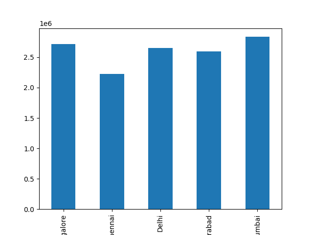
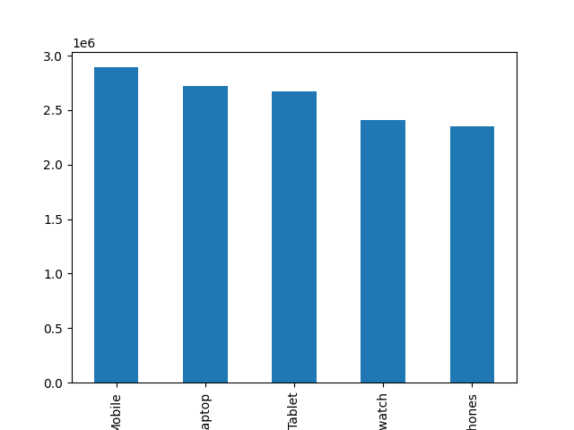

# Sales Data Analysis Dashboard

An interactive sales analytics dashboard built using Python and Streamlit to analyze sales data and visualize revenue trends.

## Features
- Data cleaning and preprocessing
- Sales trend visualization
- Revenue analysis
- Download filtered dataset

## Technologies Used
- Python
- Streamlit
- Pandas
- Matplotlib

## Dashboard Preview

## How to Run

pip install -r requirements.txt

streamlit run sales_analytics_dashboard.py
